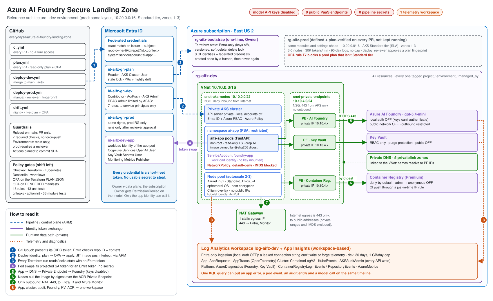
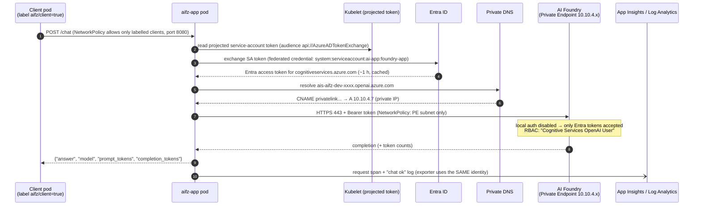
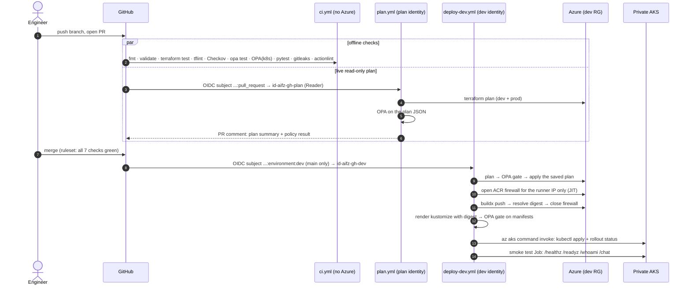
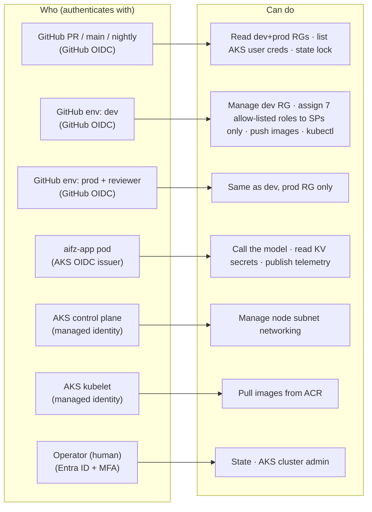
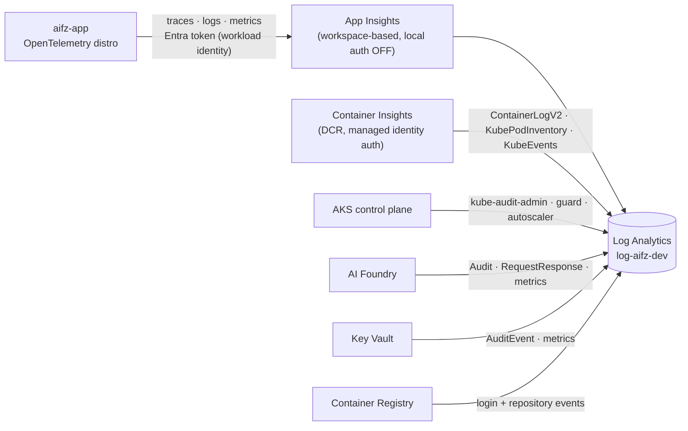
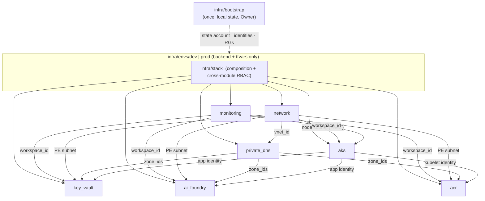

# Architecture

This document connects every part of the landing zone: **who** is allowed to do **what**, **where** traffic flows, **how** a change gets to production, and **where** every signal ends up. Each section links to the module, policy or ADR that implements it.

- [1. The whole system in one picture](#1-the-whole-system-in-one-picture)
- [2. Four journeys through the system](#2-four-journeys-through-the-system)
- [3. Identity: every principal and what it can do](#3-identity-every-principal-and-what-it-can-do)
- [4. Network: every path in and out](#4-network-every-path-in-and-out)
- [5. Observability: every signal, one workspace](#5-observability-every-signal-one-workspace)
- [6. Code layout: how the Terraform fits together](#6-code-layout-how-the-terraform-fits-together)
- [7. Defense in depth: where each control is enforced](#7-defense-in-depth-where-each-control-is-enforced)
- [8. Environments](#8-environments)
- [9. Design decisions](#9-design-decisions)

---

## 1. The whole system in one picture

Think of it as a secure office building:

- **GitHub** is the construction company. It never gets a key; it gets a visitor badge (an OIDC token) that is printed for one job and expires within the hour.
- **Entra ID** is the front desk. It checks every badge.
- **The VNet** is the building. The AI model, the secrets vault and the image registry are locked rooms with no street door (Private Endpoints only).
- **The app** is an employee with an ID card (workload identity). It opens exactly one room: the model.
- **Log Analytics** is the security camera room. Every room reports there.



*Diagram as code: [`images/generate_architecture.py`](images/generate_architecture.py) produces this SVG. Change the layout there and re-run it.*

| # | Flow | Section |
|---|---|---|
| ① | A GitHub job presents its OIDC token; Entra ID checks the repo **ID** and the context (PR, main, environment) | [3](#3-identity-every-principal-and-what-it-can-do) |
| ② | The deploy identity runs plan → OPA → apply, pushes the image through a just-in-time registry rule, and runs kubectl through ARM | [2B](#journey-b-a-code-change-reaches-dev) |
| ③ | Every Terraform run reads and locks state with an Entra token (storage keys are disabled) | [2D](#journey-d-building-the-landing-zone-from-nothing) |
| ④ | The pod swaps its projected service-account token for an Entra token; nothing secret is mounted | [2A](#journey-a-a-user-asks-the-model-a-question) |
| ⑤ | App → Private DNS → Private Endpoint → AI Foundry over 443 (keys disabled, public access off) | [4](#4-network-every-path-in-and-out) |
| ⑥ | Nodes pull the image **by digest** over the registry's Private Endpoint | [4](#4-network-every-path-in-and-out) |
| ⑦ | The only outbound path: NAT Gateway, 443, public addresses only (IMDS and private ranges blocked for pods) | [4](#4-network-every-path-in-and-out) |
| ⑧ | App traces, container logs, Kubernetes audit, and Foundry, Key Vault and registry logs → one workspace | [5](#5-observability-every-signal-one-workspace) |

The picture shows **what exists**. The journeys in section 2 show **how the parts work together**.

---

## 2. Four journeys through the system

### Journey A: a user asks the model a question

This is the runtime path. It uses no API key and no public endpoint.



What an attacker would need, and why each step fails without it:

| To call the model, you need… | Where it's enforced |
|---|---|
| to be on the private network | Foundry `public_network_access = false` · only a Private Endpoint IP exists |
| to be allowed by the NSG | PE subnet NSG: 443 **only** from the AKS node subnet |
| to be allowed by NetworkPolicy | Only `aifz-app` may egress to the PE subnet |
| an Entra token for the right identity | Keys disabled · FIC trusts **one** namespace/service account on **one** cluster issuer |
| the right RBAC role | `Cognitive Services OpenAI User` on this account only (inference, not management) |

### Journey B: a code change reaches dev

This is the delivery path. It uses no stored credentials, and a policy gate sits before every write.



Prod follows the same flow with two differences:

- A **required reviewer** approves a plan that has a **fingerprint** (the sorted list of resource addresses and actions).
- The apply job **re-plans and refuses** if the fingerprint changed. What was approved is exactly what runs.

### Journey C: the platform audits itself every night

`drift.yml` runs `terraform plan -detailed-exitcode` against the live environment with the **read-only** identity, then runs OPA on that plan. The plan contains every live resource, changed or not, so one run gives two answers:

```
exit 0 + OPA ✓      → Azure matches the code and complies  → close any open drift issue
exit 2 (drift)      → someone changed Azure outside Terraform → open/update "Drift detected: dev"
OPA ✗               → the live environment violates policy     → open/update the same issue
```

### Journey D: building the landing zone from nothing

```
make bootstrap  →  rg-aifz-bootstrap: state storage (Entra-only, versioned, locked)
                   3 GitHub identities + 4 federated credentials + constrained RBAC
                   rg-aifz-dev / rg-aifz-prod (empty, pre-scoped)
make plan/apply →  network → monitoring → private_dns → aks → key_vault → ai_foundry → acr
make deploy-app →  image by digest → private cluster
make smoke-test →  proves identity, DNS, network path and model access end to end
```

The bootstrap is the only step that runs with Owner rights, and it runs **once**, by a human. Everything after it runs with scoped, federated identities (ADR-0002).

---

## 3. Identity: every principal and what it can do

**No password, key or client secret is used anywhere** in this design. Every principal authenticates with a federated token or a managed identity. Azure still *generates* keys for Foundry, Storage and Log Analytics, but local auth is disabled on each, so those keys are inert. See [security.md](security.md) for why that distinction matters.



| Principal | Trust (how it proves who it is) | Roles and scope | Can't do |
|---|---|---|---|
| `id-aifz-gh-plan` | GitHub OIDC, subjects `pull_request` and `ref:refs/heads/main` | Reader + AKS Cluster User on each env RG; Blob Data Contributor on the state container | Change any Azure resource |
| `id-aifz-gh-dev` | GitHub OIDC, subject `environment:dev` (env accepts **main only**) | Contributor, AcrPush, AKS RBAC Cluster Admin on `rg-aifz-dev`; **ABAC-constrained** RBAC Administrator | Touch prod; grant Owner/UAA/RBAC Admin; grant any role to a **user or group** |
| `id-aifz-gh-prod` | GitHub OIDC, subject `environment:prod` (**required reviewer**, main only) | Same as dev, on `rg-aifz-prod` | Touch dev; run without approval |
| `id-aifz-dev-app` | AKS OIDC issuer → FIC `system:serviceaccount:ai-app:foundry-app` | Cognitive Services OpenAI User (Foundry) · Key Vault Secrets User · Monitoring Metrics Publisher (App Insights) | Manage anything; be used from any other namespace, service account or cluster |
| `id-aifz-dev-aks-cp` | Managed identity | Network Contributor on the VNet | n/a |
| AKS kubelet | Managed identity | AcrPull on the registry | Push images |
| Operator | Entra ID | State access · AKS RBAC Cluster Admin | Use a local kubeconfig (local accounts disabled) |

**Key subtleties:**

- **The OIDC subject is the security boundary.** This repository's subject includes GitHub's immutable IDs (`repo:everydaysa@311760416/azure-ai-foundry-landing-zone@1391048636:…`), so a deleted-and-recreated repo with the same name can't inherit trust.
- **Control plane ≠ data plane.** The subscription **Owner** got `PermissionDenied` calling the model. Owning the resource doesn't grant the right to *use* it. Only the app identity holds the data-plane role.
- **The pipeline can't escalate.** Its RBAC Administrator role carries an ABAC condition that allows only 7 named roles, assigned only to service principals (`infra/bootstrap/rbac.tf`). OPA rule T8 separately blocks Owner/UAA/RBAC Admin in the plan.

---

## 4. Network: every path in and out

```
                                 Internet
                                    ▲  443 only (Entra ID, Azure Monitor ingestion)
                                    │  one static public IP
                            ┌───────┴────────┐
                            │  NAT Gateway   │   default outbound access disabled
                            └───────┬────────┘
┌─ VNet 10.10.0.0/16 ───────────────┼────────────────────────────────────────────┐
│                                   │                                            │
│  snet-aks-nodes 10.10.0.0/22      │   NSG: deny inbound from Internet          │
│  ┌────────────────────────────────┴─────────────────────────────────────────┐  │
│  │ nodes 10.10.0.x (no public IPs)                                          │  │
│  │ pods 192.168.0.0/16 (overlay, Cilium) · services 172.16.0.0/16           │  │
│  │ NetworkPolicy: default-deny · DNS · 443 → PE subnet ·                    │  │
│  │                443 → public except RFC1918, CGNAT, 169.254/16 (IMDS)     │  │
│  └────────────────────────────────┬─────────────────────────────────────────┘  │
│                                   │ 443 only                                   │
│  snet-private-endpoints 10.10.4.0/24                                           │
│  NSG: allow 443 from snet-aks-nodes · deny all other inbound · deny outbound   │
│  ┌────────────────────────────────▼─────────────────────────────────────────┐  │
│  │ pe-ais-… (Foundry)      pe-kv-… (Key Vault)      pe-acr… (ACR)           │  │
│  └──────────────────────────────────────────────────────────────────────────┘  │
│                                                                                │
│  AKS API server: private, no public FQDN. Operators and CI reach it with       │
│  `az aks command invoke` through ARM, authorized by Entra ID + Azure RBAC.     │
└────────────────────────────────────────────────────────────────────────────────┘
  Private DNS zones linked to the VNet (strict resolution):
    privatelink.cognitiveservices.azure.com · privatelink.openai.azure.com
    privatelink.services.ai.azure.com · privatelink.vaultcore.azure.net · privatelink.azurecr.io
```

| Flow | Path | Allowed by |
|---|---|---|
| App → Foundry / Key Vault | pod → PE subnet :443 (private IP via Private DNS) | NetworkPolicy + PE NSG + PaaS firewall (public off) |
| Kubelet → ACR | node → ACR PE :443 (login server + data endpoint records) | PE NSG + ACR deny-by-default |
| App → Entra ID / Azure Monitor | pod → NAT → internet :443 | NetworkPolicy (IMDS and private ranges excluded) |
| CI → ACR (push) | runner IP → ACR public endpoint | **Just-in-time** IP rule added and removed by the deploy job (ADR-0006) |
| CI / operator → Kubernetes API | ARM `runCommand` → private API server | Entra RBAC on the cluster; no network path needed |
| Anything else | n/a | **Denied** (default-deny NetworkPolicy, NSG deny rules, `public_network_access = false`) |

**How we proved it:** from inside the cluster, the Foundry hostname resolved to `10.10.4.7`. From a laptop, the same name resolved to a public IP, which then refused the connection because public access is disabled.

---

## 5. Observability: every signal, one workspace



- **One workspace per environment.** A single query can correlate an app error with the pod restart, the API-server audit entry and the model's request log.
- **Nothing can write telemetry with a key.** Local auth is disabled on both Log Analytics and App Insights. A leaked connection string can't inject or spoof data.
- **Cost guard in dev:** a 2 GB/day cap (about 2× the measured idle volume) and 30-day retention. Prod keeps 90 days and has no cap, because security logs must never be dropped.

See [observability.md](observability.md) for table names and ready-to-run KQL.

---

## 6. Code layout: how the Terraform fits together



- **Modules** (`infra/modules/*`) are small, single-purpose and unit-tested offline (`terraform test` with a mocked provider, 38 tests). Each has a README.
- **The stack** (`infra/stack`) is the only place modules meet. It wires outputs to inputs and creates the one cross-module role (app → App Insights).
- **Environment roots** (`infra/envs/dev|prod`) contain *no logic*, only settings and a state key, so dev and prod can't diverge structurally.
- **Nothing environment-specific is committed** except non-secret settings. IDs flow from `terraform output` into the deploy at runtime.

---

## 7. Defense in depth: where each control is enforced

Every important control is checked in **more than one place**, so a single mistake or bypass doesn't silently weaken the system.

```
 write code ──▶ pre-commit ──▶ PR: ci.yml ──▶ PR: plan.yml ──▶ deploy gate ──▶ Azure / cluster ──▶ nightly
               gitleaks        Checkov         OPA on plan      OPA on plan    Entra, RBAC, NSG,     drift +
               fmt, tflint     opa test        (live values)    OPA on k8s     PSA restricted,       OPA on the
               ruff            tests, lint                                     Azure Policy          live env
```

| Control | Code | Checked by | Enforced at runtime by |
|---|---|---|---|
| No model keys | `ai_foundry` `local_auth_enabled = false` | Checkov · OPA T1 · module test | Foundry rejects key auth |
| No public PaaS | `public_network_access_enabled = false` | Checkov · OPA T4 | PaaS firewall + Private DNS |
| Entra-only telemetry | `local_authentication_enabled = false` | **OPA T2** (no Checkov check exists) | Ingestion rejects keys |
| Private, keyless cluster | `aks` module | Checkov · OPA T6 | No public API; local accounts disabled |
| Prod SLA | `sku_tier = Standard` in prod | **OPA T7** (replaces skipped CKV_AZURE_170) | n/a |
| No privilege escalation by CI | ABAC condition | **OPA T8** | Azure RBAC condition |
| Hardened pods | `k8s/base` | Checkov · OPA K1–K4 | **Pod Security Admission `restricted`** |
| Immutable images | digest in manifests | Checkov CKV_K8S_43 · OPA K1 · deploy script | `imagePullPolicy: Always` + AcrPull |
| No stored CI secrets | OIDC in workflows | actionlint · Checkov (GitHub Actions) | Entra federated credential subject match |

The full control-to-threat mapping is in [security.md](security.md).

---

## 8. Environments

| | dev (deployed) | prod (defined, plan-verified) |
|---|---|---|
| Address space | 10.10.0.0/16 | 10.20.0.0/16 (never overlaps, so they can be peered) |
| AKS tier / nodes | Free · 2–3 × D2ds_v4 · regional | **Standard (SLA)** · 3–5 × D2ds_v4 · zones 1–3 |
| Model capacity | 10K tokens/min | 30K tokens/min |
| Logs | 30 days · 2 GB/day cap | 90 days · no cap |
| Key Vault recovery | 7 days | 90 days |
| Deploys | every merge to main | manual · required reviewer · fingerprint-checked |
| Deploy identity | `id-aifz-gh-dev` (dev RG only) | `id-aifz-gh-prod` (prod RG only) |

Dev nodes are regional because this subscription got `AvailabilityZoneNotSupported` in eastus2, and they use D2ds_v4 because the DDSv5 vCPU quota was 0. Both are per-environment settings; see ADR-0007 and the runbook's quota pre-checks.

---

## 9. Design decisions

| ADR | Decision |
|---|---|
| [0001](adr/0001-keyless-identity.md) | Keyless identity everywhere |
| [0002](adr/0002-terraform-state-and-bootstrap.md) | Remote state + one-time bootstrap |
| [0003](adr/0003-network-egress.md) | NAT Gateway egress |
| [0004](adr/0004-centralized-observability.md) | One workspace, Entra-only ingestion |
| [0005](adr/0005-ai-foundry-keyless-private.md) | Foundry: keys off, private only |
| [0006](adr/0006-registry-just-in-time-ci-access.md) | Registry: deny-by-default + JIT |
| [0007](adr/0007-private-aks-workload-identity.md) | Private AKS + workload identity |
| [0008](adr/0008-kubernetes-workload-hardening.md) | Pod hardening + default-deny network |
| [0009](adr/0009-policy-as-code.md) | Checkov + OPA policy as code |
| [0010](adr/0010-cicd-pipeline.md) | Keyless, least-privilege, gated CI/CD |
